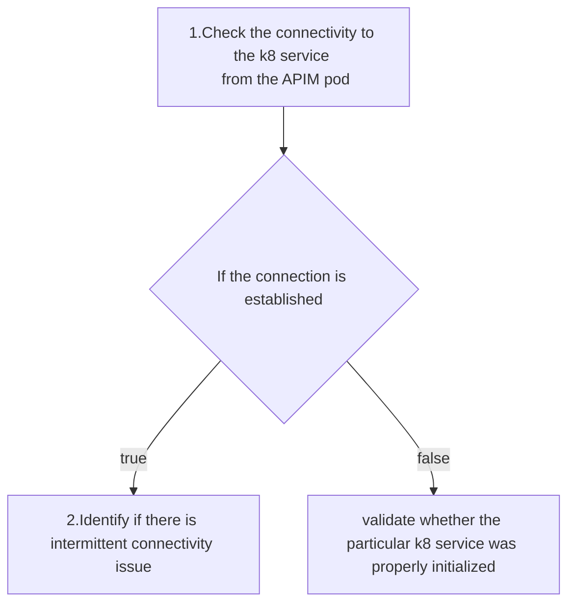

# Troubleshooting a connectivity issues in a k8 cluster

When you are working on the APIM Kubernetes deployment (specially APIM HA deployment or distributed deployment), you may observe some connectivity issues while APIM pods are tring to connect with the other pods in the cluster through the defined Kubernetes services.

Example: 
The below error can be observed when one of the APIM pods in the HA deployment, or the gateway pod, is unable to connect to the traffic management event publisher ports. In here, the connection was tring to establish through the defined Kubernetes service names. (wso2am-pattern-1-am-1-service). 
```
[2022-12-22 11:06:02,195]  WARN - DataEndpointGroup No receiver is reachable at URL Endpoint/Endpoints [tcp://wso2am-pattern-1-am-1-service:9611], will try to reconnect every 30 sec
[2022-12-22 11:06:03,239] ERROR - DataEndpointConnectionWorker Error while trying to connect to the endpoint. Cannot borrow client for ssl://wso2am-pattern-1-am-1-service:9711
```
Firstly, if you observe this issue only once during the APIM server startup logs, you don’t need to worry about this error and you can ignore this error as it is expected in the APIM active-active until both APIM pods in the deployment come to a ready state. 

However, if you observe this issue continuing even after both pods come into the ready status, you will be required to investigate this connection issue closely. I will walk you through how you can troubleshoot this kind of connectivity issue in your Kubernetes deployment. 



### 1.Check whether the connection can be established through the Kubernetes service name from the APIM pod where you observed this issue.

 Access the APIM pod where you observe this error.

```bash
  kubectl exec -it <pod_name> sh -n <namespace>
```

Perform the netcat command to check the connectivity 

```bash
  nc -zv -w 2 “<kuberetnes service name>” “port” 
```
Ex:
```bash
  nc -zv -w 3 wso2am-single-node-am-service 9711
```

:white_check_mark: If the connection were established properly, the below log will be generated 

```bash
  Connection to wso2am-single-node-am-service 9711 port [tcp/*] succeeded!
```
:x: If there is any connectivity issue, the below log will be generated after the 3 seconds timeout and you can extend the timeout period by updating the -w flag value in the command. 

```bash
  nc: connect to wso2am-single-node-am-service port 9711 (tcp) timed out: Operation now in progress
```


### 2.Identify if there is an intermittent connectivity issue

In some cases, you may observe that the connectivity was established without any issue when you performed the Netcat command from the pod. However, you are continuously observing this connection refused error in the server logs. In such cases, it is required to validate whether there is an intermittent connectivity issue. You can deploy a sidecar container along with the main APIM container within the APIM pods. Using the sidecar container you can periodically check the connectivity by performing the Netcat command.


You can define the sidecar container definition and the shell script below in order to achieve perform the Netcat command intermittently. The below definitions need to be added to the APIM k8 deployment file[1]. 

```bash
- name: sidecar-container
  image: busybox:1.32
  command: ['sh', '-c', 'echo -e "Checking the connectivity between pods through k8 service names"; while true; do sleep 1; printf "%s %s\n" "$(date)"; nc -zv -w 2 "wso2am-single-node-am-service" 9443; done; echo -e "  >> END";']
```

